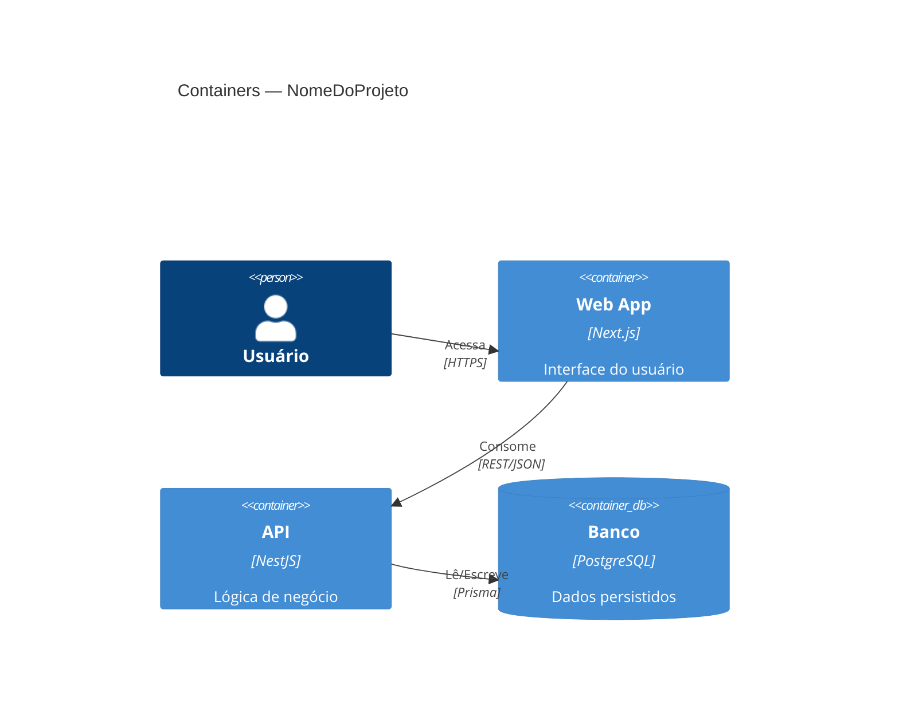

# Skill: Documentação Técnica de Projeto

Gera documentação técnica profissional a partir de informações reais do projeto.
Nunca inventa conteúdo — tudo deve vir do código-fonte ou de respostas do usuário.

---

## 1. FLUXO PRINCIPAL

```
Coletar contexto → Escolher docs → Gerar conteúdo → Validar qualidade → Entregar
```

Siga esta sequência:

1. **Coletar contexto** — Faça as perguntas da seção 2 antes de escrever qualquer doc.
2. **Definir escopo** — Identifique quais arquivos gerar (seção 3).
3. **Gerar conteúdo** — Siga as regras de cada tipo de doc (seção 4).
4. **Validar** — Aplique o checklist da seção 5 antes de entregar.
5. **Entregar** — Crie os arquivos e apresente ao usuário.

---

## 2. COLETA DE CONTEXTO

Antes de gerar qualquer documento, colete estas informações. Pergunte apenas o que
ainda não foi fornecido na conversa.

### Perguntas obrigatórias

| # | Pergunta | Por que importa |
|---|----------|----------------|
| 1 | Qual o nome e propósito do projeto? | README, architecture.md |
| 2 | Qual a stack técnica? (linguagem, framework, banco, infra) | tech-stack, infrastructure |
| 3 | É monorepo ou single-repo? Quais são os pacotes/apps? | estrutura de docs |
| 4 | Existe schema Prisma, OpenAPI ou rotas para extrair? | ERD, api-reference |
| 5 | Qual o idioma dos docs? (pt-BR ou en-US — consistente, nunca misturado) | todas as seções |

### Perguntas situacionais

Faça apenas se relevante:

- **ADR**: Qual decisão arquitetural precisa ser registrada? Quais alternativas foram consideradas?
- **API Reference**: Quais recursos (endpoints) existem? Há autenticação?
- **Infrastructure**: Quais variáveis de ambiente existem? Quais portas são usadas?
- **Flows**: Quais são os fluxos críticos do sistema? (ex: autenticação, checkout, deploy)

---

## 3. ESCOPO DOS DOCUMENTOS

### Estrutura mínima (todo projeto)

```
README.md
docs/
  index.md          ← índice navegável de todos os docs
  architecture.md   ← C4 nível 2, módulos, responsabilidades
  conventions.md    ← nomenclatura, estrutura, padrões de código
  contributing.md   ← fluxo de dev, commits, checklist de PR
  adr/
    README.md       ← índice de ADRs + template
```

### Documentos opcionais (adicione conforme necessidade)

| Arquivo | Quando gerar |
|---------|-------------|
| `docs/flows.md` | Há fluxos end-to-end complexos ou ciclos de vida |
| `docs/api-reference.md` | Projeto tem API HTTP documentável |
| `docs/data-model.md` | Há schema de banco (Prisma, SQL, ERD) |
| `docs/infrastructure.md` | Há variáveis de ambiente, scripts de deploy, troubleshooting |
| `docs/packages.md` | É monorepo com pacotes públicos |
| `docs/adr/NNN-titulo.md` | Uma ADR por decisão arquitetural relevante |

Para projetos pequenos, `architecture.md` e `flows.md` podem ser combinados.

---

## 4. REGRAS DE GERAÇÃO

### 4.1 Regras universais

- **Idioma consistente** — escolha pt-BR ou en-US e mantenha em todo o documento.
- **Sem placeholders** — nunca use TODO, FIXME, PLACEHOLDER em docs finais.
- **Links relativos** — sempre `./architecture.md`, nunca URLs absolutas entre docs do repo.
- **Conteúdo real** — extraído do código ou informado pelo usuário. Nunca invente endpoints, variáveis, módulos.
- **Todo bloco Mermaid** deve ter um heading ou legenda imediatamente antes.

### 4.2 README.md

Seções obrigatórias:
1. Badge de status (build, coverage, versão)
2. Descrição de 1 parágrafo
3. Diagrama de arquitetura (C4 Container nível 2 em Mermaid)
4. Tabela de URLs (dev, staging, prod)
5. Quick start (pré-requisitos, instalação, primeiro comando)
6. Tabela de comandos principais
7. Links para `docs/`
8. Troubleshooting básico (3–5 problemas comuns)

### 4.3 docs/architecture.md

Seções obrigatórias:
1. Diagrama C4 nível 2 (containers e relacionamentos)
2. Tabela de responsabilidades por módulo/serviço
3. Diagrama de dependências (se monorepo)
4. ERD Mermaid (se há banco de dados)
5. Links para ADRs relevantes

Exemplo de diagrama C4 mínimo:


### 4.4 docs/flows.md

- `stateDiagram-v2` para ciclos de vida (ex: status de pedido, estado de sessão)
- `sequenceDiagram` para fluxos end-to-end com atores externos
- `flowchart TD` para algoritmos ou decisões internas

### 4.5 docs/conventions.md

Seções obrigatórias:
1. Nomenclatura (arquivos, variáveis, funções, branches)
2. Estrutura de pastas
3. Validação de dados (onde e como)
4. Tratamento de erros (padrão do projeto)
5. Como adicionar um novo módulo/recurso

### 4.6 docs/contributing.md

Seções obrigatórias:
1. Fluxo de desenvolvimento (branch → PR → review → merge)
2. Convenções de commit (Conventional Commits)
3. Instruções de banco (migrations, seeds)
4. Checklist de PR (mínimo 5 itens verificáveis)

### 4.7 ADRs (docs/adr/NNN-titulo.md)

Campos obrigatórios:
- **Título** — ADR NNN: Título da Decisão
- **Status** — Proposta | Aceita | Depreciada | Substituída por ADR-NNN
- **Contexto** — Qual problema motivou a decisão
- **Decisão** — O que foi decidido
- **Alternativas Consideradas** — O que foi descartado e por quê
- **Consequências** — O que muda, riscos, débito técnico

Numeração: sequencial com zero-pad de 3 dígitos (001, 002, ...).

---

## 5. CHECKLIST DE QUALIDADE

Antes de entregar, verifique cada item:

```
[ ] Todos os arquivos da estrutura mínima existem
[ ] docs/index.md referencia 100% dos .md em docs/
[ ] README.md tem links para os docs principais
[ ] Nenhum placeholder (TODO, FIXME) presente
[ ] Idioma consistente — não mistura pt-BR e en-US
[ ] Links entre docs são relativos
[ ] Todo bloco Mermaid tem título ou legenda antes
[ ] Cada módulo/serviço tem responsabilidade documentada
[ ] ADRs têm todos os 6 campos obrigatórios
[ ] contributing.md tem checklist de PR
[ ] conventions.md cobre nomenclatura, pastas, erros
```

---

## 6. REFERÊNCIA RÁPIDA DE DIAGRAMAS MERMAID

Leia `references/mermaid-patterns.md` se precisar de:
- Sintaxe completa de `erDiagram`
- Exemplos de `sequenceDiagram` com loops e opts
- Padrões de `stateDiagram-v2` com estados compostos
- Sintaxe de `C4Container` e `C4Context`

---

## 7. CONFIGURAÇÃO DO DOC-TOOLKIT (se o projeto usa)

Use somente se o projeto depender disso. `git clone https://github.com/anxiousCamel/doc-toolkit.git`

Se o projeto usa `@doc-toolkit/cli`, leia `references/doc-toolkit-config.md` para:
- Estrutura do `DocToolkitConfig`
- Como configurar cada generator
- Como rodar `validate` e interpretar o relatório

---

## 8. EXTENSÃO DA SKILL

Para adicionar suporte a um novo tipo de doc:
1. Defina o input tipado na seção 3 (escopo)
2. Documente as seções obrigatórias na seção 4
3. Adicione os itens de checklist na seção 5
4. Se complexo, crie `references/novo-tipo.md` e referencie aqui
