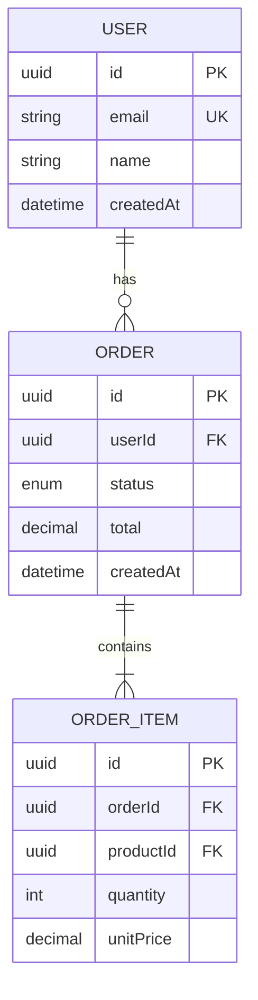
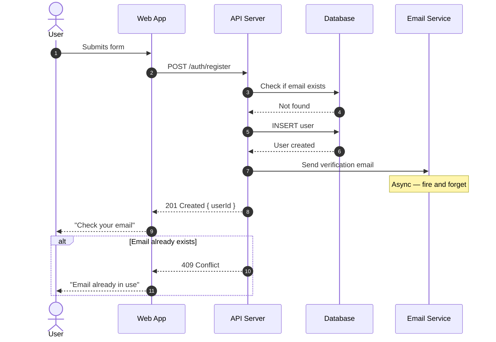
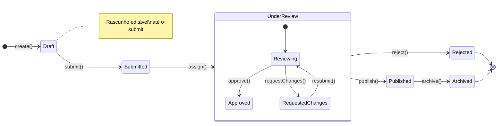
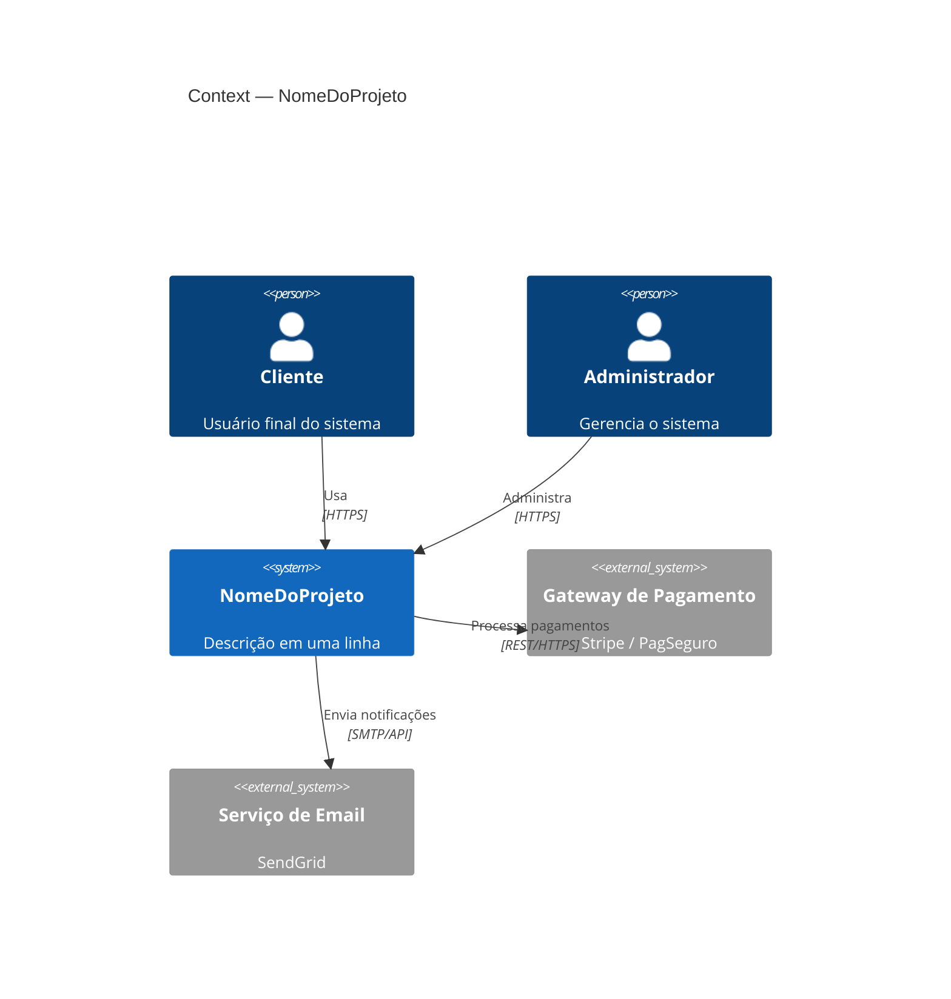
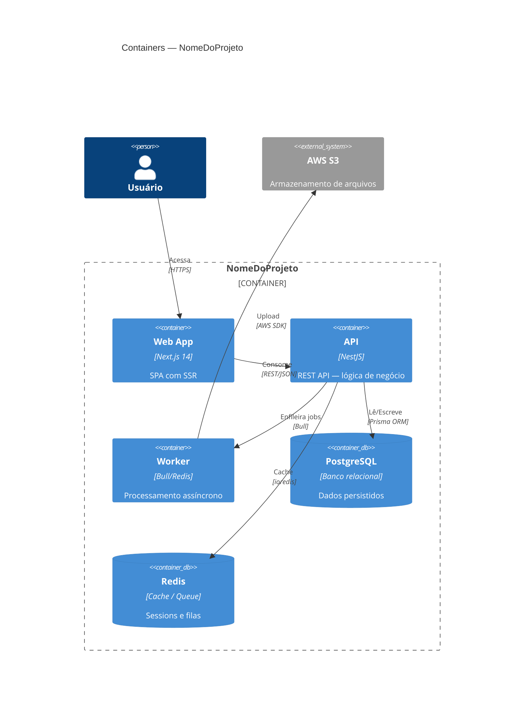
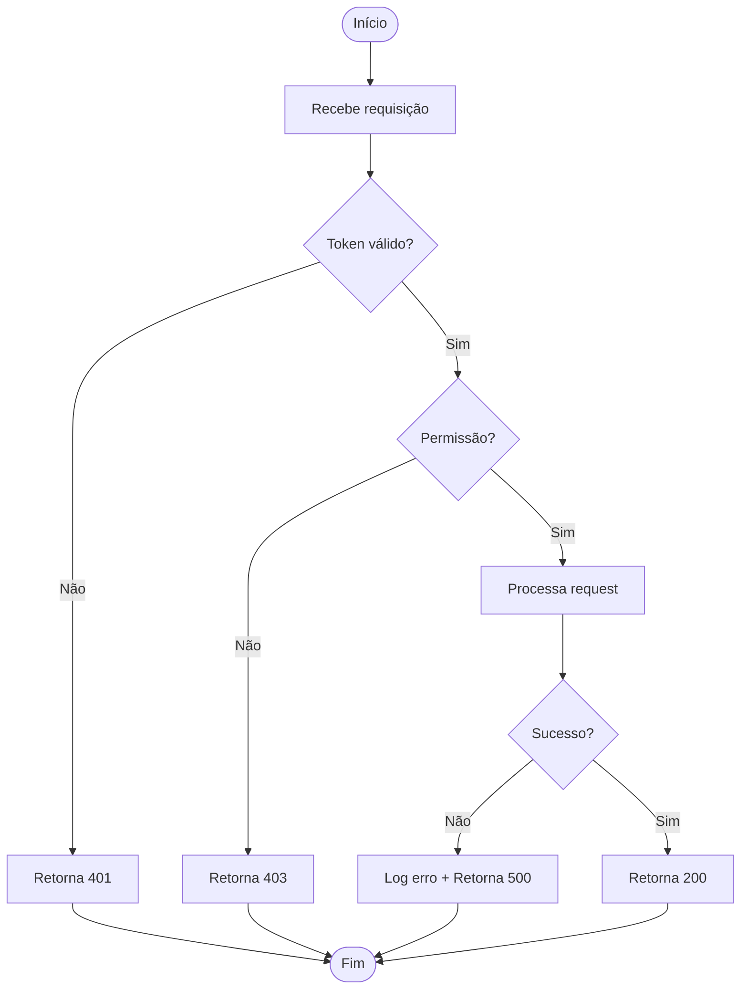

# Referência: Padrões Mermaid para Documentação

Arquivo de referência da skill `doc-project`. Carregue este arquivo apenas quando
precisar de sintaxe detalhada de diagramas Mermaid.

---

## erDiagram — Modelo de Dados



**Cardinalidades:**
- `||--||` — exatamente um para exatamente um
- `||--o{` — exatamente um para zero ou mais
- `||--|{` — exatamente um para um ou mais
- `}o--o{` — zero ou mais para zero ou mais

**Tipos de atributo comuns:** `string`, `int`, `uuid`, `decimal`, `boolean`, `datetime`, `enum`

**Restrições:** `PK` (primary key), `FK` (foreign key), `UK` (unique key)

---

## sequenceDiagram — Fluxo End-to-End



**Sintaxe de setas:**
- `A->>B` — síncrono (linha sólida, ponta aberta)
- `A-->>B` — resposta (linha tracejada, ponta aberta)
- `A-)B` — assíncrono (linha sólida, ponta aberta fina)

**Blocos condicionais:**
```
alt Caso A
  ...
else Caso B
  ...
end

opt Opcional
  ...
end

loop A cada 5 segundos
  ...
end
```

---

## stateDiagram-v2 — Ciclo de Vida



---

## C4Context — Nível 1 (Sistema no Universo)



## C4Container — Nível 2 (Containers Internos)



---

## flowchart — Algoritmo / Decisão



**Formas de nó:**
- `[texto]` — retângulo (processo)
- `{texto}` — losango (decisão)
- `(texto)` — retângulo arredondado (subprocesso)
- `([texto])` — estádio (início/fim)
- `[(texto)]` — cilindro (banco de dados)

---

## Regras de qualidade para Mermaid

1. Sempre coloque um heading (`###`) ou legenda imediatamente **antes** do bloco.
2. Nunca use caracteres especiais sem aspas nos labels: prefira `"texto com espaços"`.
3. Em `erDiagram`, use snake_case para nomes de atributos.
4. Em `sequenceDiagram`, use `autonumber` para rastreabilidade.
5. Em `C4Container`, use `Container_Boundary` para agrupar visualmente.
6. Valide sempre colando o código em [mermaid.live](https://mermaid.live) antes de commitar.
